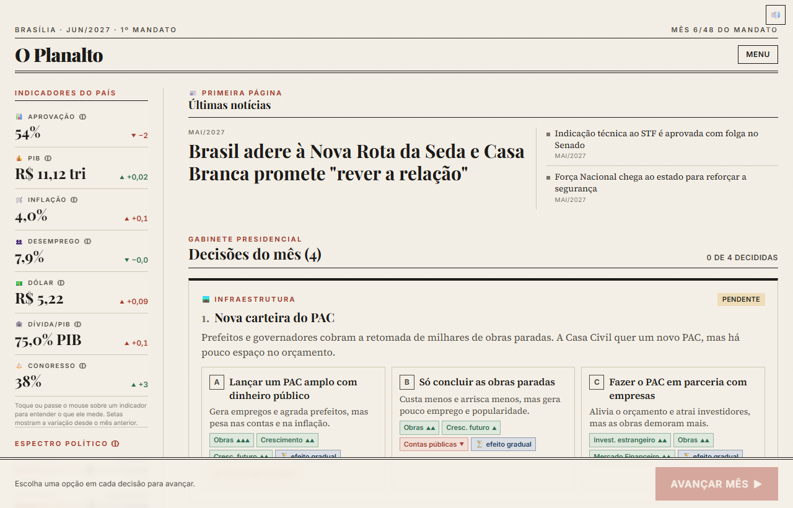
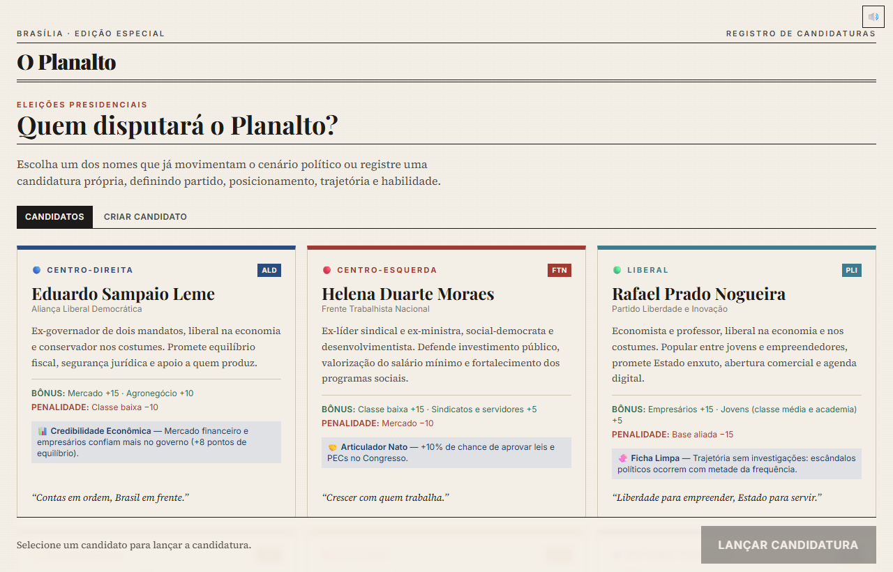
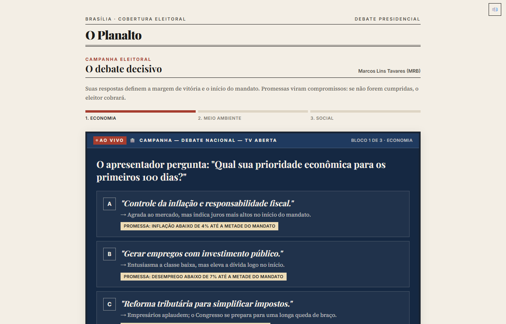
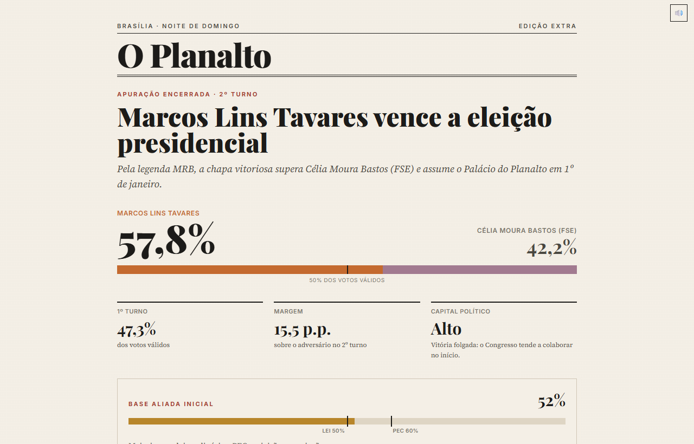
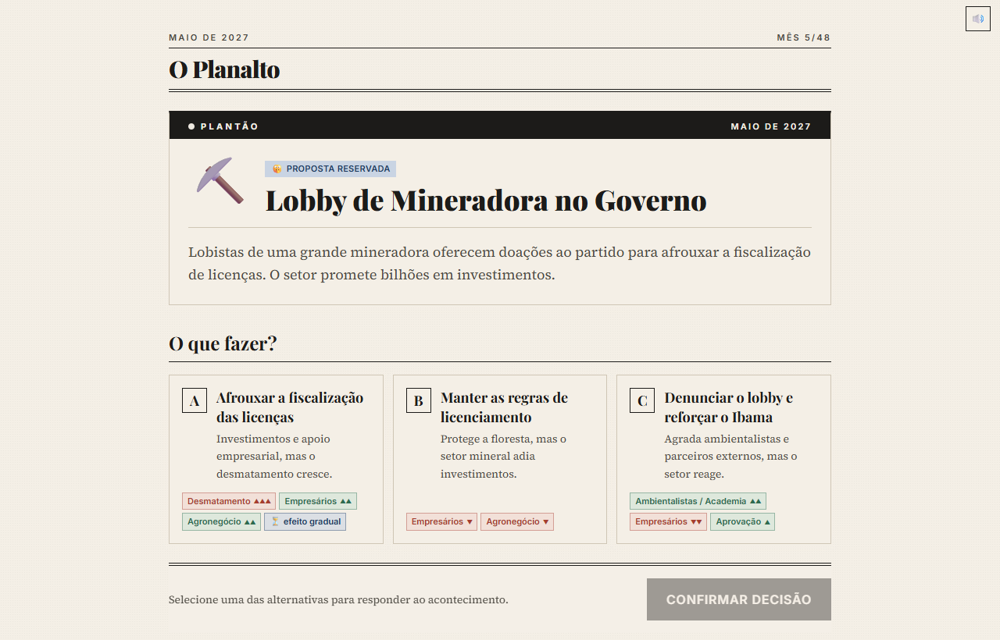
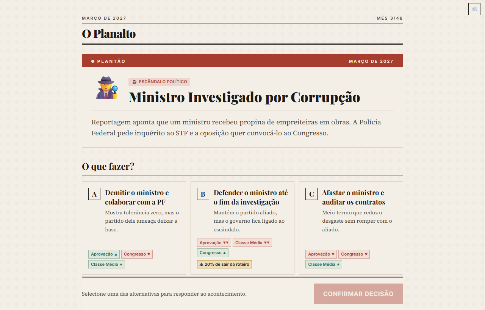
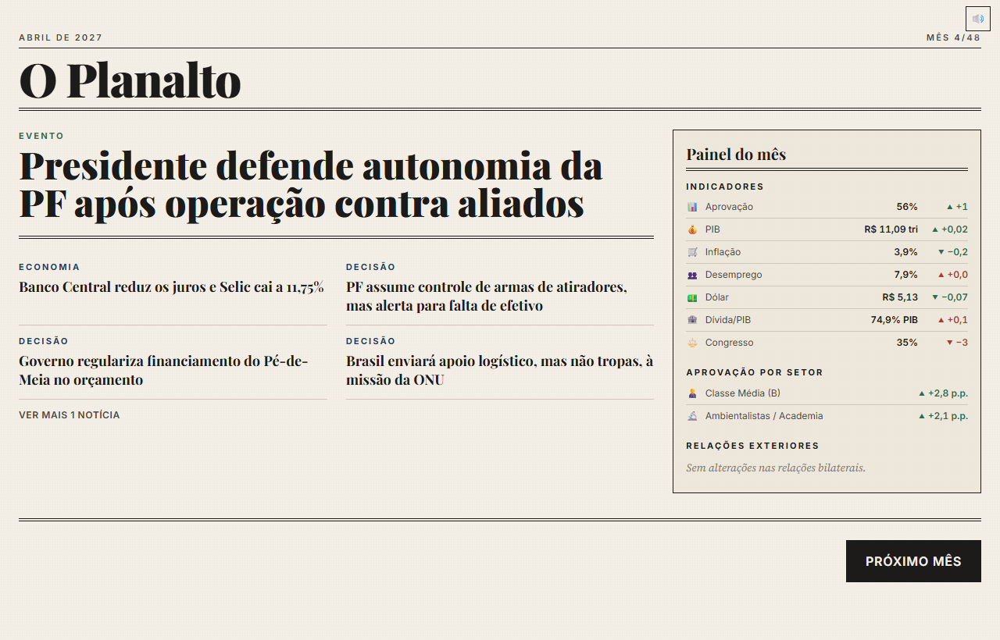
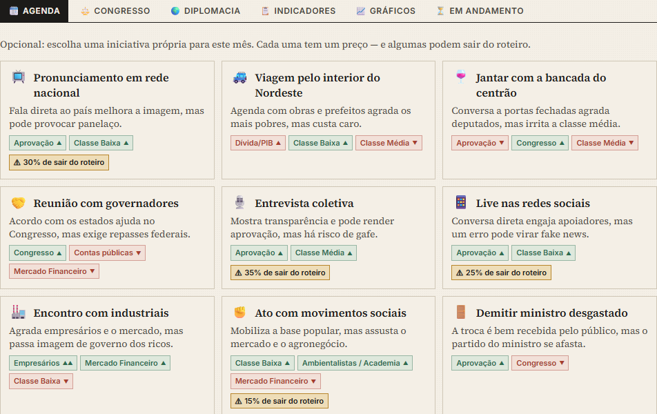
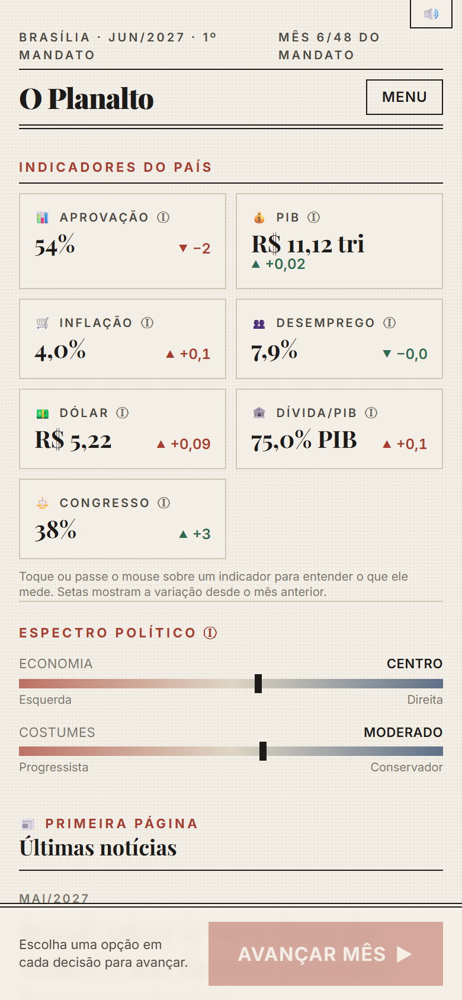

# Canetada 🇧🇷

[](https://github.com/MoreiraGustav/canetada/actions/workflows/ci.yml)
[](LICENSE)
[](CONTRIBUTING.md)

**Simulador presidencial do Brasil.** Você venceu a eleição: agora tem um mandato para governar o país, negociar com o Congresso, enfrentar crises e escândalos — e decidir até onde vai para se manter no poder.

> Jogo web, 100% no navegador, em português. Sem cadastro, sem instalação. O progresso fica salvo no próprio navegador.

<p align="center">
  
</p>

## O que dá para fazer

- **Escolher ou criar seu candidato** — do centro aos extremos — e fazer campanha num debate na TV.
- **Governar mês a mês:** 3–4 decisões por mês em nove ministérios, cada uma com trade-offs reais.
- **Lidar com o Congresso:** leis ordinárias e PECs, negociação de cargos e emendas, medidas provisórias, CPIs e impeachment.
- **Enfrentar o imprevisto:** enchentes, crises econômicas, escândalos, pandemias, Copa do Mundo e eleições municipais.
- **Escolher seu lado:** o governo se move no espectro político; posições radicais destravam pautas radicais e uma militância fiel.
- **Ceder (ou não) à corrupção:** propostas reservadas trazem ganhos imediatos — e riscos que crescem até virarem escândalo, inclusive depois do mandato.
- **Deixar um legado:** metas de governo, reeleição e uma pontuação final com título histórico.

A economia é simulada mês a mês (PIB, inflação, Selic, câmbio, dívida, desemprego), calibrada com dados públicos de IBGE, Banco Central, Tesouro, INPE e IPEA.

## Telas

| | |
|---|---|
|  |  |
| **Candidatos** — sete arquétipos, do centro aos extremos, ou crie o seu. | **Campanha** — suas respostas no debate viram promessas cobradas depois. |
|  |  |
| **Eleição** — a margem de vitória define seu capital político no Congresso. | **Propostas reservadas** — o atalho tentador que pode virar escândalo. |
|  |  |
| **Plantão** — todo mês, um acontecimento exige resposta. | **Capa do mês** — o jornal conta o que suas decisões causaram. |

<p align="center">
  
  <br /><em>Agenda presidencial: uma iniciativa livre por mês — de pronunciamentos a medidas provisórias.</em>
</p>

<p align="center">
  
  <br /><em>Feito para funcionar bem no celular.</em>
</p>

## Modos

| Modo | Duração | Partida |
|---|---|---|
| ⚡ Blitz | 1 ano (12 meses) | ~20–30 min |
| 🎯 Padrão | 2 anos (24 meses) | ~45–60 min |
| 🏛️ Mandato Completo | 4 anos (48 meses) | ~90–120 min |

Três níveis de dificuldade e reeleição para um segundo mandato.

## Rodando localmente

Requer Node 22+.

```bash
npm install
npm run dev        # http://localhost:5173
npm test           # testes (vitest)
npm run build      # build de produção em dist/
```

## Contribuindo

Contribuições são muito bem-vindas — especialmente **conteúdo** (decisões, eventos, fatos do mês), que não exige mexer no motor do jogo. Leia o [guia de contribuição](CONTRIBUTING.md) e o [código de conduta](CODE_OF_CONDUCT.md).

- 🐞 Achou um bug? [Abra uma issue](https://github.com/MoreiraGustav/canetada/issues/new?template=bug_report.yml).
- 🗳️ Tem uma ideia de decisão ou evento? [Sugira conteúdo](https://github.com/MoreiraGustav/canetada/issues/new?template=content_suggestion.yml).
- ⚖️ Algo impossível ou fácil demais? [Feedback de balanceamento](https://github.com/MoreiraGustav/canetada/issues/new?template=balance_feedback.yml).

## Stack

React 18 · TypeScript (strict) · Vite · Tailwind CSS · Zustand · Recharts · Framer Motion. Todo o motor da simulação (`src/engine/`) é feito de funções puras e testadas; o conteúdo (`src/data/`) é data-driven — novas decisões e eventos entram sem mexer no motor.

Documentação de design: [`game-design-document.md`](game-design-document.md) · contrato técnico: [`docs/SPEC.md`](docs/SPEC.md) · estado do projeto: [`PROGRESS.md`](PROGRESS.md).

## Licença

[MIT](LICENSE) © Gustavo Moreira

---

Candidatos, partidos, empresas e eventos são fictícios, inspirados na realidade política brasileira.
