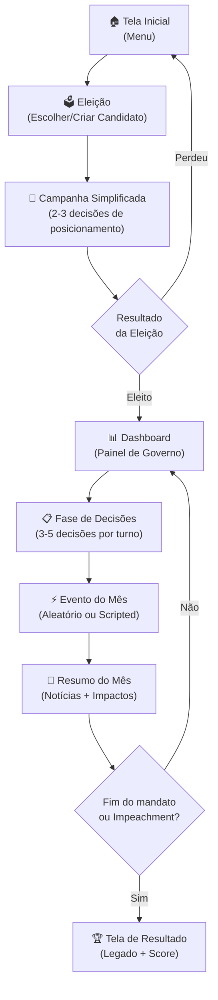
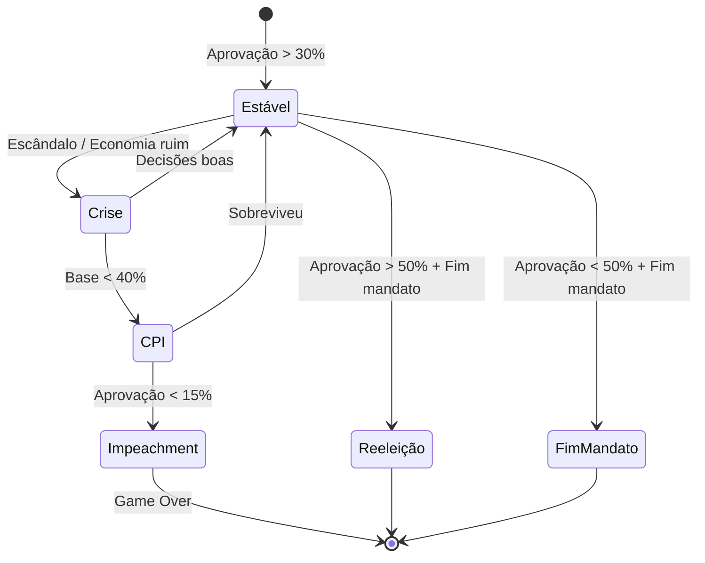

# 🇧🇷 Simulador Presidencial — Game Design Document (GDD)

> **Versão:** 0.1 — Fase de Concepção  
> **Plataforma:** Web (Browser)  
> **Gênero:** Simulador de Gestão / Estratégia Política  

---

## 1. Visão Geral

Você acabou de ser eleito **Presidente da República Federativa do Brasil**. Agora, tem **4 anos (48 turnos mensais)** para governar o país, tomar decisões estratégicas, lidar com crises, manter sua aprovação popular e deixar um legado. Cada decisão tem consequências reais baseadas em dados econômicos e sociais do Brasil.

### 1.1 Elevator Pitch
> *"Democracy 4 encontra Brasil: gerencie a maior economia da América Latina, negocie com o Congresso, forme alianças internacionais e tente sobreviver 4 anos no Planalto sem ser impedido."*

### 1.2 Público-Alvo
- Jogadores casuais interessados em política brasileira
- Entusiastas de simuladores de gestão (Democracy, Tropico, Reigns)
- Estudantes de ciências políticas e economia

### 1.3 Pilares de Design
| Pilar | Descrição |
|-------|-----------|
| **Imersão** | Dados reais, eventos baseados em fatos, linguagem institucional brasileira |
| **Consequência** | Toda decisão impacta múltiplas métricas, sem ação "grátis" |
| **Acessibilidade** | Interface limpa, turnos rápidos (~2-3 min cada), sem micromanagement |
| **Rejogabilidade** | Eventos aleatórios, diferentes estratégias de governo, múltiplos finais |

---

## 2. Estrutura do Jogo

### 2.1 Fluxo Principal



### 2.2 Modos de Jogo (Duração)

| Modo | Turnos | Equivale a | Descrição |
|------|--------|-----------|-----------|
| ⚡ **Blitz** | 12 turnos | 1 ano | Partida rápida, ideal pra conhecer o jogo (~20-30 min) |
| 🎯 **Padrão** | 24 turnos | 2 anos | Experiência equilibrada, bom pra uma sessão (~45-60 min) |
| 🏛️ **Mandato Completo** | 48 turnos | 4 anos | Experiência completa e imersiva (~90-120 min) |

> [!NOTE]
> No modo Blitz e Padrão, os eventos e metas são calibrados proporcionalmente. O jogador ainda sente progressão e consequência, mas em ritmo acelerado. O score final é comparável entre modos.

### 2.3 Sistema de Turnos
- **1 turno = 1 mês** de governo
- Cada turno tem:
  1. **Briefing** — Resumo do estado do país
  2. **Decisões** — 3 a 5 escolhas estratégicas
  3. **Evento** — Acontecimento aleatório ou programado (seca, escândalo, copa, etc.)
  4. **Resultado** — Notícias mostrando o impacto das decisões

### 2.4 🗳️ Sistema de Eleição (Pré-Jogo)

A eleição é a **porta de entrada** do jogo. Deve ser simples e rápida (~5 min), mas dar contexto e peso à experiência de governar.

#### Escolha de Candidato

O jogador pode:

**Opção A — Candidato Real**
Escolher um dos candidatos reais da política brasileira. Cada um vem com stats pré-definidos, partido, base de apoio e bônus/penalidades:

| Candidato | Partido | Perfil | Bônus Inicial | Penalidade |
|-----------|---------|--------|---------------|------------|
| 🔵 Candidato Centro-Direita | — | Liberal econômico, conservador costumes | Mercado +15, Agro +10 | Classe baixa -10 |
| 🔴 Candidato Centro-Esquerda | — | Social-democrata, desenvolvimentista | Classe baixa +15, Sindicatos +10 | Mercado -10 |
| 🟢 Candidato Liberal | — | Liberal econômico e costumes | Empresários +15, Jovens +10 | Base aliada -15 |
| 🟡 Candidato Nacionalista | — | Soberanista, estado forte | Militares +15, Segurança +10 | Relações exteriores -10 |
| 🟠 Candidato Outsider | — | Anti-establishment, renovação | Aprovação inicial +10 | Base aliada -20 |

> [!TIP]
> Os candidatos são **arquétipos inspirados** em figuras reais, sem usar nomes diretamente — isso evita problemas legais e permite liberdade criativa. Os jogadores vão reconhecer as referências.

**Opção B — Criar Seu Candidato**
O jogador monta seu próprio presidente:

| Personalização | Opções |
|---------------|--------|
| **Nome** | Livre |
| **Partido** | Escolher entre 6-8 partidos fictícios (com ideologias claras) |
| **Ideologia** | Slider: Esquerda ←→ Direita |
| **Prioridade Social** | Slider: Progressista ←→ Conservador |
| **Background** | Político veterano / Empresário / Militar / Acadêmico / Ativista |
| **Habilidade Especial** | 1 bônus passivo (ex: "Articulador Nato" → +10% chance de aprovar leis) |

#### Campanha Eleitoral (Simplificada)
Antes de assumir, o jogador faz **2 a 3 decisões de campanha** que definem suas promessas e afetam o início do mandato:

```
╔══════════════════════════════════════════════════════╗
║  🗳️ CAMPANHA — Debate Nacional                       ║
║                                                      ║
║  O apresentador pergunta: "Qual sua prioridade       ║
║  econômica para os primeiros 100 dias?"               ║
║                                                      ║
║  [A] "Controle da inflação e responsabilidade fiscal" ║
║      → Mercado +10, Selic alta no início              ║
║                                                      ║
║  [B] "Gerar empregos com investimento público"        ║
║      → Classe baixa +10, Dívida sobe no início        ║
║                                                      ║
║  [C] "Reforma tributária para simplificar impostos"   ║
║      → Empresários +10, Congresso desafiado           ║
║                                                      ║
╚══════════════════════════════════════════════════════╝
```

As promessas de campanha viram **metas implícitas** — se não cumprir, perde aprovação ao longo do mandato ("Cadê a promessa de campanha?").

#### Resultado da Eleição
- A eleição **não é aleatória** — o jogador sempre vence (o jogo é sobre governar)
- Mas a **margem de vitória** depende das decisões de campanha
- Margem alta → mais capital político inicial (base aliada maior)
- Margem apertada → começa com base aliada menor e oposição forte

---

## 3. Métricas de Governo (KPIs)

### 3.1 Métricas Principais (sempre visíveis)

| Métrica | Valor Inicial (baseado em dados reais) | Range |
|---------|----------------------------------------|-------|
| **📊 Aprovação Popular** | 45% | 0–100% |
| **💰 PIB (Trilhões R$)** | R$ 11.0 tri | Variável |
| **📈 Inflação (IPCA anual)** | 4.5% | -2% a 30%+ |
| **👥 Desemprego** | 7.8% | 2% a 25% |
| **💵 Dólar (câmbio)** | R$ 5.40 | R$ 2.00 a R$ 10.00+ |
| **🏦 Dívida Pública (% PIB)** | 74% | 30% a 150%+ |
| **⚖️ Base Aliada (Congresso)** | 55% | 0–100% |

### 3.2 Métricas Secundárias (acessíveis no painel detalhado)

| Categoria | Métricas |
|-----------|----------|
| **Social** | IDH, Índice de Gini, Taxa de Pobreza, Acesso à Saúde, Educação (IDEB) |
| **Segurança** | Taxa de Homicídios, Confiança nas Forças de Segurança |
| **Infraestrutura** | % Saneamento, Energia Renovável, Conectividade Digital |
| **Meio Ambiente** | Desmatamento (km²/ano), Emissões de CO₂, Reservas Hídricas |
| **Relações Exteriores** | Prestígio Internacional (0-100), Balança Comercial |

### 3.3 Mecânica de Aprovação
A aprovação é composta por **setores da sociedade**, cada um com peso diferente:

| Setor | Peso | Sensível a |
|-------|------|-----------|
| Classe Baixa (C/D/E) | 30% | Emprego, Bolsa Família, Inflação |
| Classe Média (B) | 25% | Impostos, Segurança, Educação |
| Empresários | 15% | Câmbio, Regulação, Juros |
| Mercado Financeiro | 10% | Fiscal, Dívida, Reformas |
| Agronegócio | 10% | Câmbio, Meio Ambiente, Infraestrutura |
| Militares / Segurança | 5% | Defesa, Ordem |
| Ambientalistas / Academia | 5% | Meio Ambiente, Ciência, Educação |

---

## 4. Sistemas de Jogo

### 4.1 🏛️ Gestão de Ministérios
O jogador **NÃO** microgerencia cada ministério. Em vez disso, define **diretrizes estratégicas**:

| Ministério | Decisões Típicas |
|-----------|-----------------|
| **Fazenda** | Meta fiscal (superávit/déficit), taxa Selic, reforma tributária |
| **Saúde** | Investimento SUS, campanhas de vacinação, saúde mental |
| **Educação** | Investimento ensino básico vs superior, ENEM, bolsas |
| **Defesa** | Orçamento militar, operações de fronteira, GLO |
| **Meio Ambiente** | Fiscalização desmatamento, créditos de carbono, parques |
| **Infraestrutura** | Rodovias, ferrovias, PPPs, saneamento |
| **Relações Exteriores** | Alianças, acordos comerciais, posicionamento em conflitos |
| **Desenvolvimento Social** | Bolsa Família, reforma agrária, moradia popular |
| **Justiça** | Reforma penal, combate à corrupção, STF |

### 4.2 🤝 Sistema de Congresso
O Congresso é uma mecânica central. Sem base aliada, o presidente é um "pato manco":

- **Base Aliada (%)** — Determina chance de aprovar leis
- Para aprovar leis ordinárias: precisa de 50%+ da base
- Para PECs (emendas constitucionais): precisa de 60%+
- **Negociação** — Trocar cargos/emendas por votos (custo político)
- **Risco de CPI** — Base fraca = risco de investigações parlamentares
- **Impeachment** — Se aprovação < 15% E base aliada < 30% → risco de impeachment



### 4.3 🌍 Relações Internacionais

#### Países/Blocos com Mecânica Ativa

| País/Bloco | Relação Inicial | Interesses |
|-----------|----------------|-----------|
| 🇺🇸 **EUA** | Neutra (60/100) | Comércio, democracia, segurança hemisférica |
| 🇨🇳 **China** | Parceria (70/100) | Commodities, investimento em infraestrutura |
| 🇪🇺 **União Europeia** | Amigável (65/100) | Mercosul-UE, meio ambiente, direitos humanos |
| 🇦🇷 **Argentina** | Aliada (75/100) | Mercosul, integração regional |
| 🇷🇺 **Rússia** | Neutra (55/100) | BRICS, fertilizantes, geopolítica |
| 🇮🇳 **Índia** | Neutra (50/100) | BRICS, comércio |
| 🌍 **África** (bloco) | Neutra (50/100) | Cooperação Sul-Sul, lusofonia |
| 🌎 **BRICS** | Ativo | Multilateralismo, moeda alternativa |
| 🌎 **Mercosul** | Ativo | Integração comercial regional |

#### Mecânicas de Diplomacia
- **Acordos Comerciais** — Reduzem tarifas, afetam setores internos (+/-) 
- **Visitas de Estado** — Boost temporário de relação
- **Posicionamento em Conflitos** — Escolher lados afeta múltiplas relações
- **Sanções** — Aplicar ou sofrer sanções econômicas
- **Investimento Estrangeiro** — Melhor relação = mais IDE (Investimento Direto Estrangeiro)

### 4.4 ⚡ Sistema de Eventos
Eventos são o "tempero" do jogo — criam urgência e imprevisibilidade.

#### Tipos de Eventos

| Tipo | Frequência | Exemplos |
|------|-----------|----------|
| **Crise Econômica** | Raro | Crash global, fuga de capitais, hiperinflação |
| **Desastre Natural** | Moderado | Enchentes no RS, seca no Nordeste, queimadas na Amazônia |
| **Escândalo Político** | Moderado | Corrupção ministerial, vazamento de áudio, CPI |
| **Oportunidade** | Moderado | Descoberta de recurso, alta de commodities, Copa/Olimpíada |
| **Internacional** | Frequente | Guerra comercial, pandemia, crise migratória |
| **Social** | Frequente | Protestos, greves, movimento cultural |

#### Exemplo de Evento
```
╔══════════════════════════════════════════════════╗
║  ⚡ EVENTO — Março/2027                          ║
║                                                  ║
║  🌊 ENCHENTES NO RIO GRANDE DO SUL               ║
║                                                  ║
║  Chuvas torrenciais atingiram o estado,          ║
║  deixando 500 mil desabrigados.                  ║
║                                                  ║
║  O que fazer?                                    ║
║                                                  ║
║  [A] Decreto de emergência + R$ 5 bi             ║
║      (+Aprovação, -Fiscal, +Infraestrutura)      ║
║                                                  ║
║  [B] Ajuda moderada via programas existentes     ║
║      (Neutro)                                    ║
║                                                  ║
║  [C] Delegar aos estados e municípios            ║
║      (-Aprovação, +Fiscal)                       ║
║                                                  ║
╚══════════════════════════════════════════════════╝
```

### 4.5 🏆 Sistema de Metas e Legado
No início do mandato, o jogador escolhe **3 metas prioritárias** de uma lista:

| Meta | Critério de Sucesso |
|------|-------------------|
| 🏗️ Infraestrutura | Construir X km de ferrovias/rodovias |
| 📚 Educação para Todos | IDEB acima de X |
| 🌱 Brasil Verde | Reduzir desmatamento em X% |
| 💼 Pleno Emprego | Desemprego abaixo de 5% |
| 🏥 Saúde Universal | Cobertura SUS em 95%+ |
| 💰 Controle Fiscal | Dívida/PIB abaixo de 65% |
| 🌍 Potência Global | Prestígio internacional acima de 80 |
| ⚖️ Justiça Social | Reduzir Gini em X pontos |
| 🔒 Segurança | Reduzir homicídios em X% |
| 🏠 Moradia Digna | Déficit habitacional reduzido em X% |

**Score Final** baseado em:
- Metas cumpridas (40%)
- Aprovação final (25%)
- Estado da economia (20%)
- Eventos sobrevividos (15%)

---

## 5. Interface do Usuário (UI/UX)

### 5.1 Telas Principais

#### Dashboard (Tela Principal)
```
┌─────────────────────────────────────────────────────────────┐
│  🇧🇷 SIMULADOR PRESIDENCIAL          Mês 3/48 — Mar/2027   │
├──────────────┬──────────────────────────────────────────────┤
│              │                                              │
│  📊 45%      │    📰 ÚLTIMAS NOTÍCIAS                       │
│  Aprovação   │    ─────────────────                         │
│              │    • "Presidente envia reforma tributária     │
│  💰 R$11.0T  │      ao Congresso"                           │
│  PIB         │    • "Dólar cai com otimismo do mercado"     │
│              │    • "Enchentes afetam sul do país"           │
│  📈 4.5%     │                                              │
│  Inflação    │    ┌──────────────────────────────────┐      │
│              │    │  DECISÕES PENDENTES (3)           │      │
│  👥 7.8%     │    │                                   │      │
│  Desemprego  │    │  [1] Política Monetária — Selic   │      │
│              │    │  [2] Acordo Mercosul-UE           │      │
│  💵 R$5.40   │    │  [3] Orçamento Saúde 2027        │      │
│  Dólar       │    └──────────────────────────────────┘      │
│              │                                              │
│  ⚖️ 55%      │    [▶ AVANÇAR MÊS]                           │
│  Congresso   │                                              │
├──────────────┴──────────────────────────────────────────────┤
│  🎯 Metas: Educação ██████░░ 62%  |  Fiscal ████░░░░ 45%   │
└─────────────────────────────────────────────────────────────┘
```

### 5.2 Princípios de UX
- **Mobile-first** — Funcionar bem em celular
- **Feedback visual imediato** — Setas verdes/vermelhas nas métricas
- **Tooltips informativos** — Explicar cada métrica para o jogador casual
- **Notícias como narrativa** — Manchetes estilo Folha/G1 para imersão
- **Animações suaves** — Transições entre turnos, gráficos animados
- **Som ambiente** — Música de fundo institucional, som de notificação

---

## 6. Dados Reais Utilizados

### 6.1 Fontes de Dados
| Dado | Fonte |
|------|-------|
| PIB, Inflação, Desemprego | IBGE, Banco Central |
| Dívida Pública | Tesouro Nacional |
| Taxa Selic | COPOM/Banco Central |
| Balança Comercial | MDIC |
| Desmatamento | INPE (PRODES/DETER) |
| Educação | INEP (IDEB, ENEM) |
| Saúde | DataSUS |
| Segurança | Atlas da Violência (IPEA) |
| Relações Internacionais | Itamaraty / fontes públicas |

### 6.2 Calibração
Os valores iniciais serão baseados em dados de **2024-2025**, calibrados para que:
- Decisões populistas deem resultado de curto prazo mas causem problemas
- Decisões técnicas/impopulares demorem a dar resultado mas sejam sustentáveis
- Existe um "equilíbrio" difícil de manter (como na vida real)

---

## 7. Stack Tecnológica (Proposta)

| Camada | Tecnologia | Justificativa |
|--------|-----------|---------------|
| **Frontend** | React + TypeScript | Componentização, tipagem, ecossistema |
| **UI Framework** | Tailwind CSS | Rapidez, responsividade, customização |
| **Gráficos** | Chart.js ou Recharts | Gráficos de métricas interativos |
| **Animações** | Framer Motion | Transições suaves entre turnos |
| **Estado** | Zustand | Leve, simples, sem boilerplate |
| **Build** | Vite | Rápido, moderno |
| **Deploy** | Vercel ou Netlify | Gratuito, CI/CD automático |

> [!NOTE]
> O jogo é **100% client-side** — toda a lógica roda no navegador. Sem necessidade de backend. Save/load via `localStorage`.

---

## 8. Roadmap de Desenvolvimento

### Fase 1 — MVP (Core Loop) 🎯
- [ ] Setup do projeto (React + Vite + Tailwind)
- [ ] Engine de simulação (métricas + fórmulas de impacto)
- [ ] Sistema de turnos básico
- [ ] 5 tipos de decisões
- [ ] Dashboard com métricas principais
- [ ] 10 eventos iniciais
- [ ] Tela de início e fim de jogo

### Fase 2 — Polimento
- [ ] Sistema de Congresso (base aliada, votações)
- [ ] 20+ eventos adicionais
- [ ] Relações internacionais (3 países)
- [ ] Sistema de metas e score
- [ ] Notícias geradas dinamicamente
- [ ] Responsividade mobile

### Fase 3 — Expansão
- [ ] Todos os países/blocos
- [ ] Sistema de ministros (nomeação/demissão)
- [ ] Árvore de políticas (tech tree de reformas)
- [ ] Múltiplos cenários de início
- [ ] Achievements
- [ ] Compartilhamento de score

---

## 9. Decisões de Design (Definidas)

> [!NOTE]
> Decisões alinhadas e fechadas. Servem como referência durante o desenvolvimento.

### 🎨 Visual e Tom

| # | Questão | Decisão |
|---|---------|---------|
| 1 | **Tom do jogo** | ✅ **Sério e realista** — sem humor/sátira, linguagem institucional |
| 2 | **Estilo de arte** | ✅ **Editorial/jornal** — visual inspirado em grandes veículos de imprensa |
| 3 | **Identidade visual** | ✅ **Paleta própria** — cores autorais, não preso ao verde/amarelo institucional |

### 🎮 Gameplay

| # | Questão | Decisão |
|---|---------|---------|
| 4 | **Dificuldade** | ✅ **Com níveis** (Fácil / Normal / Difícil) — calibra margem de erro e agressividade de crises |
| 5 | **Tutorial** | ✅ **Sem tutorial formal** — o jogo é autoexplicativo, jogador aprende jogando |
| 6 | **Reeleição** | ✅ **Sim, com reeleição** — duração do 2º mandato segue o modo escolhido (Blitz +12, Padrão +24, Completo +48) |
| 7 | **Criação de personagem** | ✅ **Candidatos-arquétipo reais + criação custom** (definido na seção 2.4) |

### 📊 Simulação

| # | Questão | Decisão |
|---|---------|---------|
| 8 | **Profundidade econômica** | ✅ **Apenas agregado** — PIB total, sem modelar setores individuais. Mantém acessibilidade |
| 9 | **Aleatoriedade** | ✅ **Sistema misto inteligente** — 40% eventos aleatórios puros + 60% eventos condicionais (consequência do mandato). Ex: se desmatamento alto → evento "pressão internacional sobre Amazônia" tem chance maior de aparecer. Crises econômicas aparecem mais se indicadores estão ruins. Isso cria um jogo justo mas imprevisível |

### 🔧 Técnico

| # | Questão | Decisão |
|---|---------|---------|
| 10 | **Salvar progresso** | ✅ **Apenas localStorage** — simples, sem export/import |
| 11 | **Idioma** | ✅ **Apenas PT-BR** |
| 12 | **Música/Som** | ✅ **Com áudio** — música ambiente + efeitos, com opção de mute/volume |

---

## 10. Referências e Inspirações

| Jogo | O que pegar |
|------|-----------|
| **Democracy 4** | Sistema de políticas interconectadas |
| **Reigns** | Decisões binárias com consequências em 4 eixos |
| **Tropico** | Humor + gestão + geopolítica |
| **Crisis in the Kremlin** | Simulação política realista |
| **NationStates** | Dilemas políticos com trade-offs |
| **Budget Hero** | Simulação fiscal educativa |

---

*Documento criado em 02/10/2026 — Aguardando feedback para iterar.*
